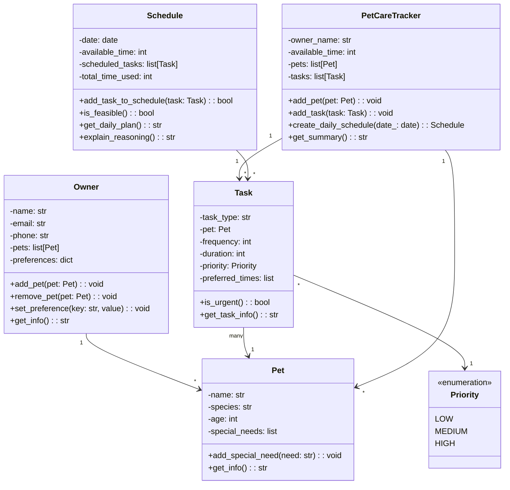

# PawPal Class Structure

## Relationships

- **Owner** has many **Pets**
- **Task** belongs to a **Pet** and uses **Priority** enum
- **PetCareTracker** manages multiple **Pets** and **Tasks**, creates **Schedules**
- **Schedule** contains multiple **Tasks**
